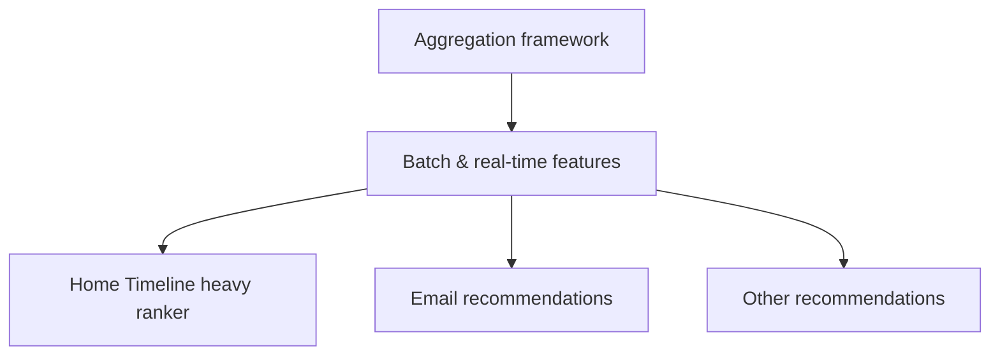

# Answers

## What are some features we can compute?
The framework creates simple count-based features by grouping interactions with sparse IDs (like user ID, user+author, or tweet ID) and tallying them over time.

```mermaid
flowchart TD
  A[User interactions] --> B[Pick grouping key\n(userId, user+author, tweetId, ...)]
  B --> C[Count/aggregate over time]
  C --> D[Aggregate features]
```

## What implementations are supported?
There are two modes: a daily batch pipeline that writes aggregates to Manhattan for serving, and a real-time streaming pipeline (Storm + memcache) for fresh counts.

```mermaid
flowchart TD
  A[Input DataRecords] --> B1[Batch job (daily)]
  A --> B2[Streaming via Storm]
  B1 --> C1[Aggregate features]
  C1 --> D1[Upload to Manhattan]
  B2 --> C2[Real-time aggregates]
  C2 --> D2[Memcache backing store]
  D1 --> E[Online hydration]
  D2 --> E
```

## Where is this used?
These aggregate features feed the Home Timeline heavy ranker and are also used in email and other recommendation surfaces.


